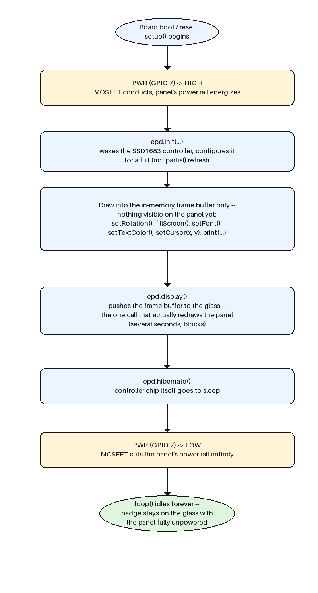

# Desk badge lifecycle



(generated by `generate_flowchart.py` -- run `python3 generate_flowchart.py`
to regenerate if this description or the diagram ever drift apart)

This sketch runs the sequence below exactly once, on boot, then sits idle
forever -- there's no loop to revisit and no branching, unlike
`test_card.ino`'s receive loop.

0. **Library and display object (compile-time, before `setup()` runs).**
   Every `epd.*` call below belongs to a `GxEPD2_BW<...>` object from the
   **GxEPD2** library, declared once as a global naming the exact panel
   controller and its four SPI pins, e.g.:
   ```cpp
   #include <GxEPD2_BW.h>
   GxEPD2_BW<GxEPD2_420_GYE042A87, GxEPD2_420_GYE042A87::HEIGHT> epd(
     GxEPD2_420_GYE042A87(/*CS=*/45, /*DC=*/46, /*RES=*/47, /*BUSY=*/48));
   ```
   `display_text.ino` declares the same object the same way -- see that
   file if you want to check the exact syntax.

   Official docs (also in `docs/reference.md`):
   - [GxEPD2](https://github.com/ZinggJM/GxEPD2) -- the library itself
   - [ConnectingHardware.md](https://github.com/ZinggJM/GxEPD2/blob/master/ConnectingHardware.md) -- pin-mapping/wiring reference
   - [GxEPD2 Discussions](https://github.com/ZinggJM/GxEPD2/discussions) -- official support venue
   - [Adafruit_GFX guide](https://learn.adafruit.com/adafruit-gfx-graphics-library) -- the base class GxEPD2 extends; `setCursor()`/`setFont()`/`print()`/`fillScreen()` all come from here
1. **`setup()` begins.** Board has just booted or reset.
2. **`PWR` (GPIO 7) -> HIGH.** Same MOSFET switch from the warm-up exercise --
   this energizes the e-paper panel's entire power rail. Nothing before this
   step can talk to the panel at all.
3. **`epd.init(...)`.** Wakes the SSD1683 controller chip and configures it
   for a full-window refresh (this project never uses partial refresh). The
   controller is now ready to accept drawing commands, but the glass itself
   hasn't changed yet.
4. **Draw into the frame buffer.** `setRotation()`, `fillScreen()`,
   `setFont()`, `setTextColor()`, `setCursor(x, y)`, `print(...)` -- all of
   this only edits an in-memory buffer. The panel still shows whatever it
   showed before this sketch ran.
5. **`epd.display()`.** The one call that actually pushes the buffer to the
   glass and physically redraws it. Blocks for several seconds while the
   e-paper refreshes.
6. **`epd.hibernate()`.** Puts the *controller chip* to sleep -- distinct
   from cutting power, this just tells the chip itself to idle.
7. **`PWR` (GPIO 7) -> LOW.** Cuts the MOSFET, de-energizing the panel's
   power rail completely.
8. **`loop()` idles forever.** Because e-paper holds its image with zero
   power, the badge stays visible indefinitely even though the panel is now
   fully unpowered -- "power down for good" is literal here.
